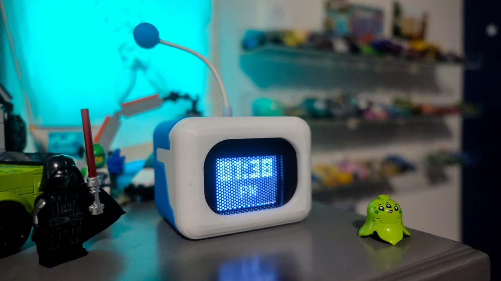

# Building Astrobot: An Arduino Alarm Clock With Personality



*A gift for my son that became a deep dive into embedded programming, pixel art on a 128x160 screen, and making magic with $25 of parts.*

---

## Why I Built This

My son loves the Astrobot character from the game — the little expressive robot with the big eyes. You can't buy this anywhere. So when I stumbled across [Birdy-C's Astrobot Clock](https://github.com/Birdy-C/Puzzle-with-3D-Printer/tree/main/Astrobot%20Clock) on GitHub, I knew it was the perfect project to build together.

I've built Arduino projects before, so this wasn't my first rodeo. But this one was different — it wasn't just about making something work. It was about making something *charming*. A little bot that looks around, blinks, shows the time, and beats its heart when you knock on it. The kind of thing my son could put on his nightstand and actually want to keep.

I ordered the parts from Microcenter and Amazon, 3D-printed the enclosure, and started hacking.

## What It Is

Astrobot is a small desktop bot with a 1.8" TFT screen as its face. It runs on an Arduino Nano (well, an Inland Nano clone — $8 at Microcenter) and cycles between:

- **Animated eyes** — pixel-art eyes that blink and look left/right
- **A digital clock** — reads the current time from a real-time clock module
- **A heartbeat animation** — when you knock on it, the screen shows beating hearts and plays a melody

There's also an alarm mode that loops the melody at a configurable time. All of this in a 3D-printed enclosure that looks like a little robot head.

### The Parts

| Component | Cost |
|-----------|------|
| [Inland Nano (ATmega328P)](https://www.microcenter.com/product/615097/inland-nano-development-board-arduino-compatible) | ~$8 |
| 1.8" ST7735 TFT (128x160) | ~$5 |
| HW-084 DS1307 RTC (with CR2032) | ~$3 |
| SW-420 vibration sensor | ~$2 |
| [Adafruit Mini Speaker (1.5W 8 ohm)](https://www.adafruit.com/product/1891) | ~$5 |
| **Total** | **~$23-28** |

All sourced from Microcenter and Amazon. No soldering required if you use a breadboard, or the right wires, though I ended up soldering the speaker wires for a cleaner build.

## How It Works: The Architecture

The entire sketch is built around a **non-blocking state machine** — no `delay()` calls anywhere. This is the single most important design decision in the project, and it's what makes everything feel smooth and responsive.

### The Four States

```
SHOW_EYES  <-->  SHOW_DATE  <-->  VIBRATION_DETECTED  <-->  ALARMING
```

1. **SHOW_EYES** (default) — Displays animated eyes for ~10 seconds. The eyes blink, look left, look right, with random pauses between expressions.

2. **SHOW_DATE** — Renders the current time in 12-hour format with AM/PM. Reads from the DS1307 RTC over I2C. Lasts ~5 seconds.

3. **VIBRATION_DETECTED** — Triggered when the SW-420 sensor fires. Plays a melody and shows a 13-frame beating heart animation.

4. **ALARMING** — When the configured alarm time hits, loops the melody continuously until dismissed by a knock or 60-second timeout.

Each state runs for a set duration using `millis()`, then transitions to the next. The melody player, animation system, and clock display all operate independently — nothing blocks anything else.

### The Pixel Rendering System

This is where it gets interesting. The ATmega328P has **2KB of RAM**. You can't store full animation frames in RAM — a single 128x160 1-bit frame would be 2,560 bytes. More than the entire RAM.

The solution: store everything in **PROGMEM** (flash memory) and render using **diff-based animation**.

Each animation frame is stored as two arrays:
- `white_pixels` — coordinates of pixels to turn ON
- `black_pixels` — coordinates of pixels to turn OFF

Instead of redrawing the entire screen each frame, the renderer only touches the pixels that *changed* between frames. This means each animation step might only draw 5-20 pixels instead of thousands.

Here's what a frame looks like in `pixel_data.h`:

```c
static const PROGMEM byte white_pixels_astrobot1[] = {
  34,3, 35,3, 36,3, 37,3, 38,3, 39,3,  // coordinates of pixels to light up
  // ... more x,y pairs
};
static const byte * const white_pixels[] PROGMEM = { white_pixels_astrobot1, white_pixels_astrobot2, /* ... */ };
```

The Python script `eyes/ImagesToCArray.py` does the heavy lifting — it takes a sequence of PNG sprite frames, computes the pixel diffs between consecutive frames, and outputs the C arrays. I just had to create the pixel art in Aseprite, export the frames, and run the script.

### Eye Mirroring

The bot has two eyes, but I only store one eye's worth of animation data. The right eye is drawn by taking the left eye's pixel coordinates and offsetting them by 80 pixels (x + 80 on the 128px-wide screen).

For the "looking left" vs "looking right" effect, the `_INVERT` variant mirrors the left eye by computing `77 - x`, flipping the eye horizontally. It's a clever trick that halves the data storage needed.

### The Melody Player

The melody is its own mini state machine. Each note in the melody is defined as:

```c
{ frequency_Hz, note_duration_ms, rest_duration_ms }
```

The `updateMelody()` function runs every `loop()` iteration, checking elapsed time against the current note's duration. No blocking, no delays — the melody plays alongside everything else.

The melody itself was converted from a MIDI file of the "Astro Bot Theme" using [ShivamJoker's MIDI-to-Arduino converter](https://github.com/ShivamJoker/MIDI-to-Arduino). Just drop the MIDI in, get a C array out.

## The Challenges

### Challenge 1: Pin Conflicts

The Arduino Nano has limited pins. The TFT display needs SPI (SCLK, MOSI, CS, DC, RES), and the DS1307 RTC needs I2C (SDA, SCL on A4/A5). Problem: the hardware SPI pins overlap with the I2C bus.

**Solution:** Use software SPI on analog pins A1 (SCLK) and A2 (MOSI), freeing up A4/A5 for I2C. The TFT's CS pin moved from A5 to D2, and RES from A4 to D5. It's slower than hardware SPI, but at 128x160 with diff-based rendering, you don't need the speed.

### Challenge 2: Memory Constraints

2KB of RAM. That's it. Every byte counts.

- All pixel data lives in PROGMEM (flash), not RAM
- The font data is stored in PROGMEM via Adafruit GFX's `PROGMEM` support
- Even the melody array lives in flash
- The state machine avoids large local variables or stack-heavy function calls

The diff-based rendering system was the key insight. Instead of buffering an entire frame, only the changed pixels are processed each cycle. This keeps peak RAM usage well under the limit.

### Challenge 3: Animation Smoothness

Getting smooth animation on a 128x160 TFT with software SPI required careful timing. The frame rate depends on how many pixels change between frames, which varies. The diff-based approach helps — a blink animation might only change 30 pixels, while a full eye movement might change 100+.

The trick was balancing animation complexity against the SPI transfer time. More pixels = slower frame rate. The 5-frame blink and 13-frame heartbeat sequences were designed to be light enough for smooth playback.

### Challenge 4: 3D Printing the Enclosure

The enclosure files came from the [original project](https://github.com/Birdy-C/Puzzle-with-3D-Printer/tree/main/Astrobot%20Clock) — I didn't design this one myself. Instead of buying a printer or fiddling with settings, I found a local non-profit that offers 3D printing services. I got to support them and walk away with a clean print, no headaches involved. Sometimes the best tool is the one you don't have to own.

## The Code

The entire project lives in a single `.ino` file (`astrobot_hw084.ino`, ~520 lines) with supporting header files. Here's the high-level flow:

```cpp
void setup() {
  // Init TFT, RTC, vibration sensor, speaker
  // Load animation pointers from pixel_data.h
  // Sync time from DS1307
}

void loop() {
  unsigned long now = millis();
  
  updateMelody();          // Advance melody if playing
  readVibration();         // Check for knocks
  
  switch (currentState) {
    case SHOW_EYES:
      updateEyes(now);     // Draw eye animation frames
      if (now - stateStart > 10000) transitionTo(SHOW_DATE);
      break;
      
    case SHOW_DATE:
      updateClock(now);    // Render time from RTC
      if (now - stateStart > 5000) transitionTo(SHOW_EYES);
      break;
      
    case VIBRATION_DETECTED:
      updateHeart(now);    // Draw heart animation
      if (!melodyPlaying) transitionTo(SHOW_EYES);
      break;
      
    case ALARMING:
      updateClock(now);    // Show time in red
      updateMelody();      // Loop melody
      break;
  }
}
```

Everything runs on `millis()` timers. The animation frames advance at their own pace, the melody has its own timer, and the state transitions happen independently. This non-blocking design is what makes the bot feel alive — it's always doing something, never frozen waiting.

## What I'd Do Differently

If I built this again:

1. **Use hardware SPI for the TFT** — I'd pick a board with enough SPI-capable pins that don't conflict with I2C. The software SPI works but it's the bottleneck for frame rate.

2. **Add more animation frames** — The 5-frame blink is charming, but more frames would make it smoother. The PROGMEM approach scales well here.

3. **Consider an ESP32** — More RAM, more processing power, WiFi for NTP time sync instead of a dedicated RTC module. But that defeats the "$25 parts" constraint.

## What My Son Learned

Beyond the finished product, this project was about introducing him to the idea that you can *make things*. Not just download an app or buy a toy — but design something, code it, solder it, print it, and have a physical object that you built from scratch.

## Resources

- **Source code:** [GitHub - pipozoft/astrobot](https://github.com/pipozoft/astrobot)
- **Based on:** [Birdy-C's Astrobot Clock](https://github.com/Birdy-C/Puzzle-with-3D-Printer/tree/main/Astrobot%20Clock)
- **Arduino libraries:** [Adafruit GFX](https://github.com/adafruit/Adafruit-GFX-Library), [Adafruit ST7735](https://github.com/adafruit/Adafruit-ST7735-Library), [RTClib](https://github.com/adafruit/RTClib)
- **MIDI converter:** [ShivamJoker/MIDI-to-Arduino](https://github.com/ShivamJoker/MIDI-to-Arduino)

---

*Built with love, frustration, and a lot of troubleshooting on a Saturday afternoon. If you build your own, share it — I'd love to see what expressions you come up with.*
